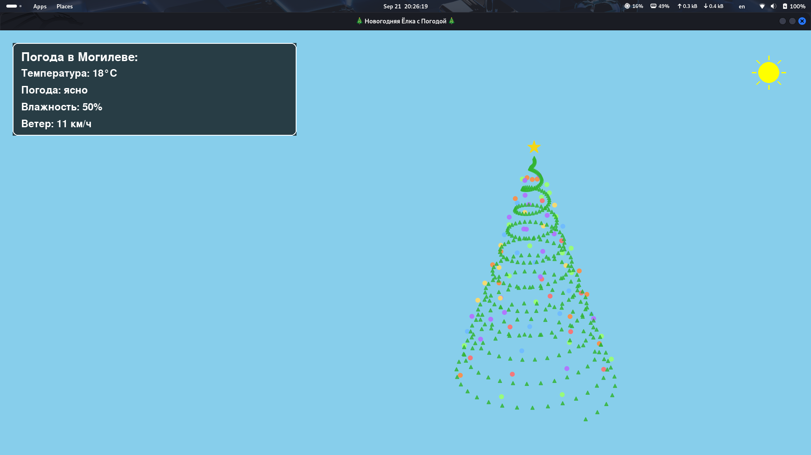

<div align="center">
  
# 🎄 Thee v1.0.0


> ❄️ Интерактивная 3D-ёлка с погодой в реальном времени и атмосферными эффектами  
> 🌤️ Погода из API • 🎵 Музыка по погоде • 🎨 Динамические эффекты • 🖼️ 3D-анимация

</div>

---

## 📋 Оглавление
- [📖 О проекте](#-о-проекте)
- [✨ Возможности](#-возможности)
- [📸 Демонстрация](#-демонстрация)
- [📥 Установка и запуск](#-установка-и-запуск)
- [🎮 Использование](#-использование)
- [🛠 Технологии](#-технологии)
- [🧱 Архитектура](#-архитектура)
- [🔧 Решение проблем](#-решение-проблем)
- [📄 Лицензия](#-лицензия)
- [📬 Контакты](#-контакты)

---

## 📖 О проекте

**Thee** — это креативное десктопное приложение, которое превращает ваш рабочий стол в волшебную новогоднюю сцену с 3D-ёлкой, реагирующей на реальную погоду в вашем городе.

> 🎯 **Основная идея:** Погода за окном влияет на атмосферу в приложении: снег, дождь, облака, музыка и даже цвет ёлки меняются в реальном времени!

### 🔥 Ключевая особенность
Приложение подключается к **wttr.in API** и автоматически адаптирует визуальные и аудио-эффекты под текущие погодные условия в Могилёве (или другом городе).

---

## ✨ Возможности

| Фича | Описание |
|------|----------|
| 🌤️ **Погода в реальном времени** | Автоматическое получение данных через wttr.in API каждые 5 минут |
| 🎄 **3D-анимация ёлки** | Вращающаяся трёхмерная ёлка с гирляндами и звездой (Matplotlib + Pygame) |
| 🎨 **Динамический фон** | Цвет фона меняется в зависимости от погоды: солнце, облака, дождь, снег |
| ❄️ **Атмосферные эффекты** | Снежинки, капли дождя, облака, молнии — всё рендерится в реальном времени |
| 🎵 **Музыка по погоде** | Автоматический подбор саундтрека: рождественские мелодии под текущую погоду |
| 🌫️ **Спецэффекты для ёлки** | Туман и снег накладываются непосредственно на 3D-модель |
| 📊 **Инфо-панель** | Отображение температуры, влажности, ветра и описания погоды |
| 🖥️ **Адаптивное окно** | Поддержка изменения размера окна без потери качества |

---

## 📸 Демонстрация

<div align="center">

| ☀️ Ясная погода |
|:--------------:|
|  |
| *Голубое небо, солнце, зелёная ёлка* |

</div>

---

## 📥 Установка и запуск

### ⚡ Быстрый старт

```bash
# 1. Клонируйте репозиторий
git clone https://github.com/Andrey3141/Thee.git
cd Thee

# 2. Установите зависимости
pip install -r requirements.txt

# 3. Запустите приложение
python thee.py
```

### 📦 Требования
| Компонент | Версия | Назначение |
|-----------|--------|-----------|
| 🐍 Python | 3.8+ | Основной язык |
| 🎮 Pygame | 2.5+ | Графика и анимация |
| 📊 Matplotlib | 3.7+ | 3D-рендеринг ёлки |
| 🖼️ Pillow | 10.0+ | Обработка изображений |

---

## 🎮 Использование

### 1️⃣ Первый запуск

1.  Запустите `python thee.py`
2.  Откроется окно с 3D-ёлкой и текущей погодой
3.  Приложение автоматически начнёт получать данные из Могилёва

### 2️⃣ Как работает магия ✨

| Погода | Фон | Ёлка | Эффекты | Музыка |
|--------|-----|------|---------|--------|
| ☀️ Ясно / Солнечно | Голубое небо | 🟢 Зелёная | Солнце с лучами | `sunny_christmas.mp3` |
| ☁️ Облачно | Серо-голубой | 🟢 Зелёная | Плывущие облака | `cloudy_christmas.mp3` |
| 🌧️ Дождь | Тёмно-синий | 🟢 Тёмно-зелёная | Капли дождя | `rainy_christmas.mp3` |
| ❄️ Снег | Светло-голубой | ⚪ Снежно-голубая | Падающие снежинки | `snowy_christmas.mp3` |
| ⚡ Гроза | Тёмно-фиолетовый | 🟢 Зелёная | Молнии + вспышки | `rainy_christmas.mp3` |
| 🌫️ Туман | Серый | 🟢 Зелёная + туман | Эффект дымки | `cloudy_christmas.mp3` |
| 🎄 Рождество | Ночное небо | 🟢 Зелёная | Звёзды + луна | `christmas.mp3` |

### 3️⃣ Управление

| Действие | Как сделать |
|----------|------------|
| 🔄 **Обновить погоду** | Ждите 5 минут или перезапустите приложение |
| 🖼️ **Изменить размер** | Потяните за край окна (поддерживается) |
| ❌ **Закрыть** | Нажмите `X` в углу окна или `Alt+F4` |

### 4️⃣ Настройка города

В файле `thee.py` найдите строку:
```python
weather = get_weather_simple("могилев")
```
Замените `"могилев"` на ваш город на русском или английском:
```python
weather = get_weather_simple("moscow")  # или "минск", "spb", и т.д.
```

---

## 🛠 Технологии

```
🐍 Python 3.8+     — основной язык
🎮 Pygame          — 2D-графика, анимация, обработка событий
📊 Matplotlib      — 3D-рендеринг ёлки (FigureCanvasAgg)
🖼️ Pillow          — загрузка и конвертация изображений
🌐 requests        — HTTP-запросы к wttr.in API
🧵 threading       — фоновое обновление погоды без блокировки UI
```

### 📊 Распределение кода

| Модуль | Роль |
|--------|------|
| 🟣 `thee.py` | Главное приложение: цикл Pygame, рендеринг, эффекты, управление |
| 🟢 `weather.py` | Модуль получения погоды: парсинг JSON с wttr.in |
| 🔵 `gif.py` | Утилита создания GIF-анимаций (опционально) |

---

## 🧱 Архитектура

```
Thee/
├── 📄 thee.py                 # Главное приложение
│   ├── 🎄 ChristmasTree       # Класс 3D-ёлки (matplotlib)
│   │   ├── create_tree_animation_frames()  # Пререндер кадров
│   │   ├── apply_fog_effect()  # Наложение тумана
│   │   └── apply_snow_effect() # Наложение снега
│   │
│   ├── 🌤️ WeatherManager     # Управление погодой
│   │   ├── weather_input_handler()  # Фоновый поток обновления
│   │   ├── update_weather_effects() # Обновление частиц
│   │   └── draw_weather_effects()   # Отрисовка эффектов
│   │
│   ├── 🎨 VisualRenderer      # Отрисовка
│   │   ├── draw_weather_info()  # Инфо-панель
│   │   ├── draw_cloud()         # Облака
│   │   └── main loop (60 FPS)   # Игровой цикл
│   │
│   └── 🎵 AudioManager        # Музыка
│       └── play_weather_music() # Подбор трека по погоде
│
├── 📄 weather.py              # API-модуль
│   └── get_weather_simple()   # Запрос к wttr.in + парсинг
│
├── 📁 music/                  # Саундтреки
│   ├── christmas.mp3
│   ├── sunny_christmas.mp3
│   ├── cloudy_christmas.mp3
│   ├── rainy_christmas.mp3
│   └── snowy_christmas.mp3
│
├── 📁 1/                      # Исходные изображения для GIF
│   ├── 1.jpg, 2.jpg, 3.jpg
│
├── 📄 gif.py                  # Утилита создания анимаций
├── 📄 requirements.txt        # Зависимости
└── 📁 screenshots/            # Скриншоты для README
```

### 🔗 Поток данных: Погода → Визуал

```
1. Фоновый поток (threading)
   ↓
2. Запрос к https://wttr.in/могилев?format=j1
   ↓
3. Парсинг JSON: температура, описание, влажность, ветер
   ↓
4. Обновление глобальных переменных: current_weather, current_temperature...
   ↓
5. Главный цикл Pygame читает переменные
   ↓
6. Применяет: фон, эффекты, музыку, цвет ёлки
   ↓
7. Рендер кадра (60 FPS)
```

---

## 🔧 Решение проблем

<details>
<summary>❌ Ошибка: «No module named pygame»</summary>

```bash
pip install pygame>=2.5.0
```
</details>

<details>
<summary>❌ Ошибка: «No module named matplotlib»</summary>

```bash
pip install matplotlib>=3.7.0
```
</details>

<details>
<summary>❌ Погода не обновляется / ошибка API</summary>

1.  Проверьте интернет-соединение
2.  Убедитесь, что город указан корректно: `get_weather_simple("ваш_город")`
3.  Приложение автоматически переключится на режим «рождество» при ошибке
4.  Проверьте лимиты wttr.in (бесплатно: ~1 запрос/минуту)
</details>

<details>
<summary>❌ Ёлка не отображается / чёрный экран</summary>

1.  Убедитесь, что установлен `matplotlib` и `Pillow`
2.  Попробуйте запустить с правами администратора (проблема с OpenGL)
3.  Обновите драйверы видеокарты
4.  Попробуйте уменьшить разрешение окна
</details>

<details>
<summary>❌ Музыка не играет</summary>

1.  Проверьте, что файлы в папке `music/` существуют
2.  Убедитесь, что `pygame.mixer` инициализирован (есть `pygame.mixer.init()`)
3.  Проверьте системную громкость и устройства вывода
</details>

<details>
<summary>❌ Низкая производительность / лаги</summary>

1.  Уменьшите количество частиц в `create_snowflakes()` / `create_raindrops()`
2.  Снизьте частоту кадров: `clock.tick(30)` вместо `60`
3.  Отключите тяжёлые эффекты в `draw_weather_effects()`
4.  Пререндерите больше кадров ёлки заранее
</details>

---

## 🎨 Добавление своей погоды / музыки

### Добавить новый тип погоды

1.  В `thee.py` добавьте запись в словари:

```python
# WEATHER_TRANSLATIONS
'your_weather': 'ваш_перевод',

# WEATHER_BG_COLORS
'your_weather': (R, G, B),

# TREE_COLORS
'your_weather': '#HEX_COLOR',

# music_mapping в play_weather_music()
'your_weather': "your_track.mp3",
```

2.  Добавьте файл `your_track.mp3` в папку `music/`

### Создать свою анимацию ёлки

Отредактируйте `create_tree_animation_frames()`:
- Измените параметры `x_tree`, `y_tree`, `z_tree` для формы
- Поэкспериментируйте с `marker`, `s` (размер), `alpha` (прозрачность)
- Добавьте новые цвета в `garland_colors`

---

## 🤝 Вклад в проект

Приветствуются PR и Issues! 🙌

1.  Форкните репозиторий
2.  Создайте ветку: `git checkout -b feature/your-feature`
3.  Закоммитьте изменения: `git commit -m 'feat: add your feature'`
4.  Отправьте: `git push origin feature/your-feature`
5.  Откройте Pull Request

---

## 📄 Лицензия

<div align="center">

[](LICENSE)

Проект распространяется под лицензией **MIT**.  
См. файл [LICENSE](LICENSE) для подробностей.

</div>

---

<div align="center">

## 📬 Контакты и поддержка

> 💬 Есть вопрос, идея или нашли баг? Пишите!

[](https://github.com/Andrey3141)
[](https://t.me/tools271)
[](mailto:askackov08@gmail.com)

</div>

---

<div align="center">

### 🙏 Благодарности

- **wttr.in** за бесплатный и удобный API погоды 🌤️
- **Pygame Team** за отличный фреймворк для 2D-графики 🎮
- **Matplotlib** за возможность 3D-рендеринга в Python 📊
- **Pillow Team** за обработку изображений 🖼️

---

**Thee** — пусть погода за окном становится частью вашего праздника! 🎄❄️

*Сделано с ❤️ на Python + Pygame + Matplotlib*

</div>
